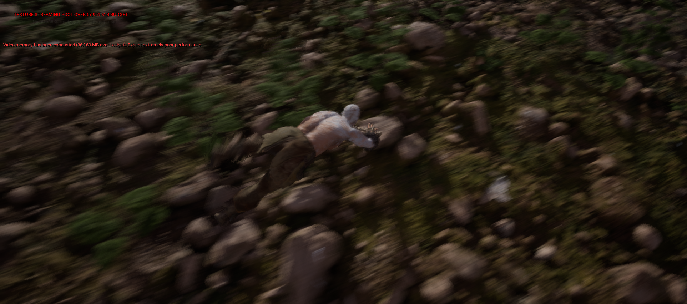
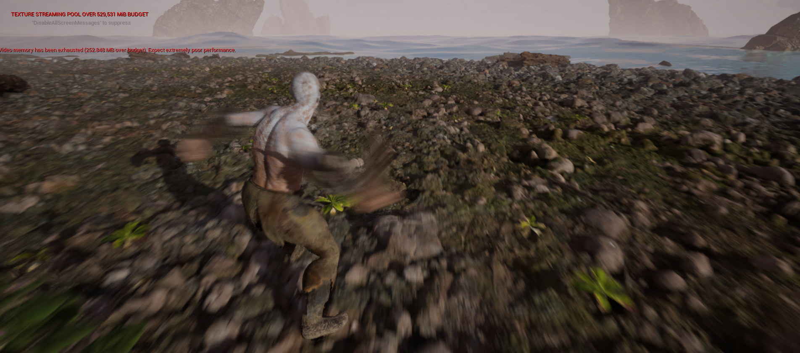
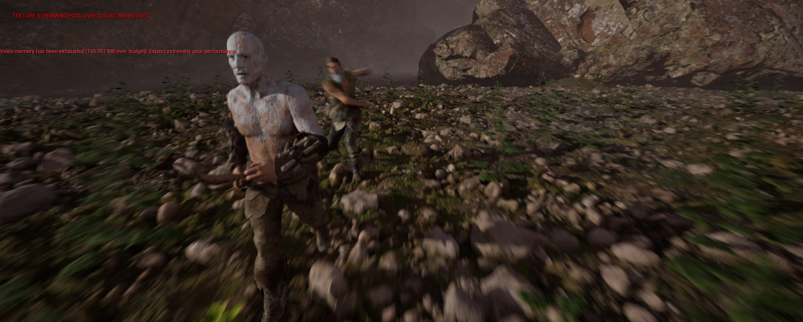
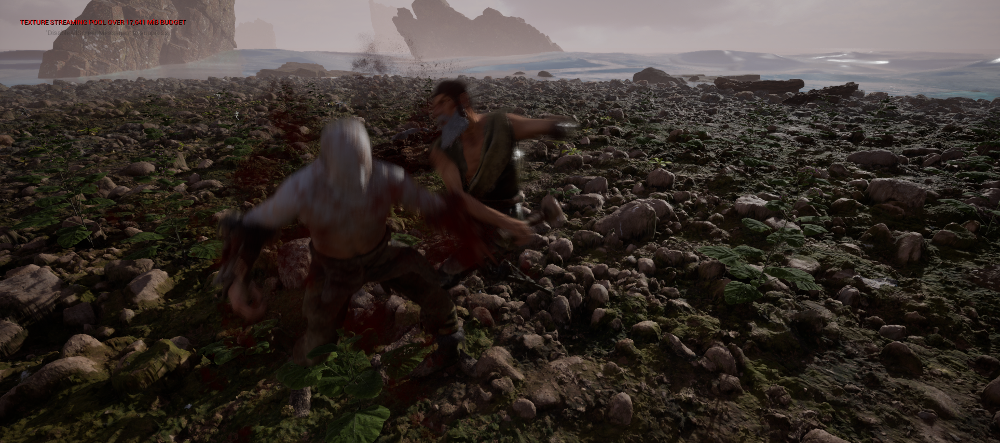
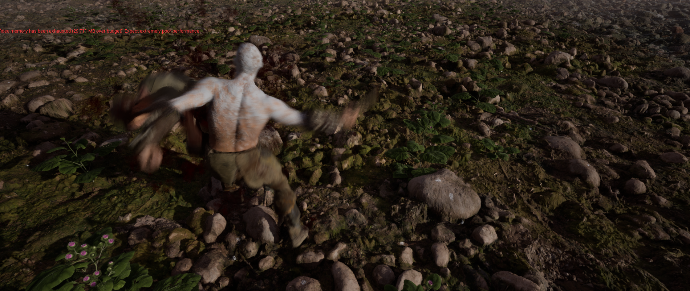

# UE5 Combat System

This repository contains a customizable combat system developed for Unreal Engine 5. It includes features suitable for various types of action and role-playing games. The system is designed to be modular, allowing easy integration and modification according to specific game needs.

## Features

- **Character Movement**: Implements smooth and responsive character movement with support for sprinting, dodging, and jumping.
- **Combat Mechanics**: Includes basic melee and ranged attack functionalities, along with hit detection and damage calculation.
- **Animation System**: Integrates with UE5's animation system to synchronize character actions with combat moves, ensuring fluid transitions and realistic responses.
- **AI Integration**: Provides a basic AI system for enemy characters, including basic pathfinding and attack behaviors.
- **Health & Stamina**: Manages health and stamina systems with regeneration mechanics and visual indicators for player feedback.
- **Camera System**: Implements a third-person camera system with dynamic targeting, providing a more immersive combat experience.
- **Modular Design**: The system is modular, making it easy to extend or customize specific components like weapons, abilities, or animations.
